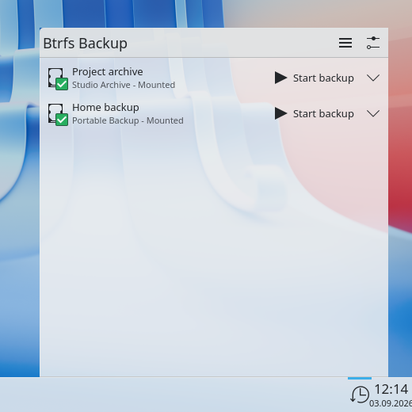
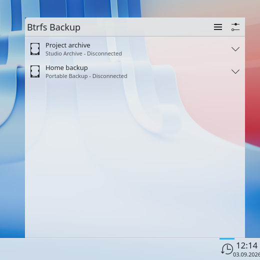
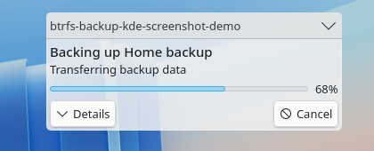
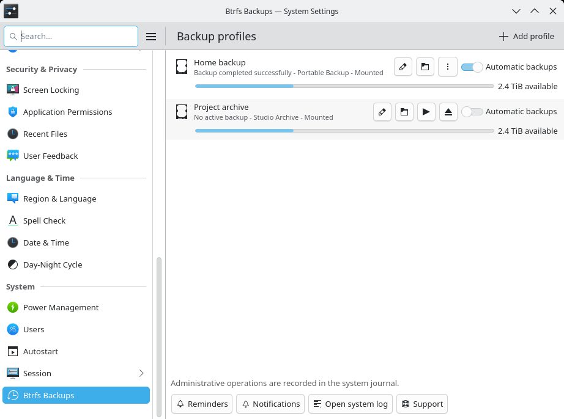
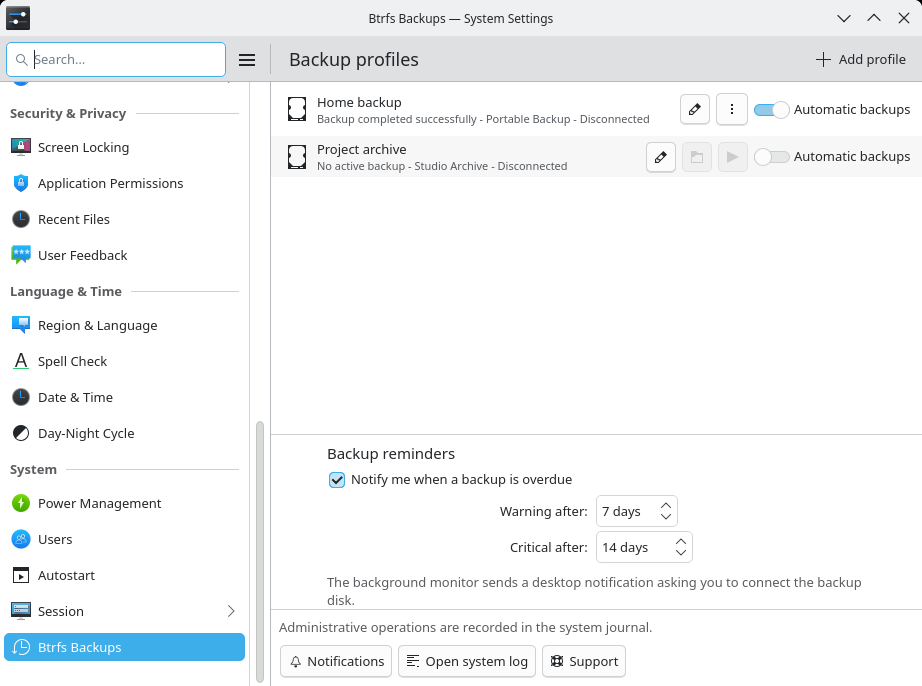
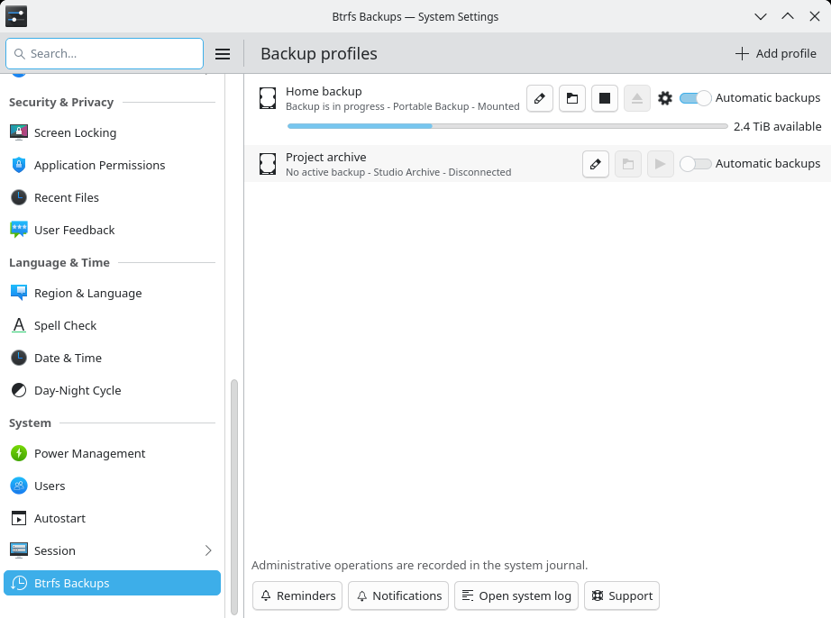

# btrfs-backup

`btrfs-backup` creates unattended, incremental backups of Btrfs subvolumes on
an encrypted removable disk. Connect the configured drive, let udev and systemd
run the backup, then safely disconnect it when the job finishes.

The core runtime works without a desktop. An optional KDE package adds setup in
System Settings, live progress, notifications, backup browsing in Dolphin and a
guided restore application.

### Plasma Widget

| Profiles collapsed | Target connected |
|---|---|
| [](docs/images/plasma-widget-collapsed.png) | [](docs/images/plasma-widget-connected.png) |

| Target disconnected | Backup in progress |
|---|---|
| [](docs/images/plasma-widget-disconnected.png) | [](docs/images/plasma-widget-transferring.png) |

### Desktop Progress And Notifications

| Native transfer progress | Backup completed |
|---|---|
| [](docs/images/kui-job-transferring.png) | [](docs/images/notification-completed.png) |

### System Settings

| Targets connected | Targets disconnected | Backup in progress |
|---|---|---|
| [](docs/images/system-settings-connected.png) | [](docs/images/system-settings-disconnected.png) | [](docs/images/system-settings-transferring.png) |

### Guided Restore


The screenshots use sample data and are rendered deterministically from the
repository with [`tools/render-readme-screenshot.sh`](tools/render-readme-screenshot.sh).

## What You Get

- full and incremental `btrfs send/receive` with UUID-based parent selection;
- read-only local and target snapshots with independent retention policies;
- safe interrupted-transfer recovery through `.incoming` snapshots and
  `pending` markers;
- exact LUKS device matching, mapper validation, free-space checks and
  controlled unmount and LUKS closure;
- multiple backup sources and profiles;
- passwordless per-profile control over automatic backups from Plasma and
  System Settings;
- CLI repository discovery, version browsing and transactional restore;
- an optional system D-Bus manager with sanitized status and Polkit-protected
  administration;
- optional Plasma, System Settings, Dolphin, KIO and KRunner integration.

## Install On Arch Linux

Install the base release package:

```bash
sudo pacman -U btrfs-backup-4.0.0-1-x86_64.pkg.tar.zst
```

For the KDE desktop tools, install the matching optional package:

```bash
sudo pacman -U btrfs-backup-kde-4.0.0-1-x86_64.pkg.tar.zst
```

The base package installs the systemd and udev templates but does not enable a
backup or create an active profile. The KDE package does not become a runtime
dependency of unattended backups.

## Quick Start

### 1. Prepare A Profile

Start by rendering the proposed configuration into a normal directory:

```bash
btrfs-backupctl profile wizard \
  --render-only \
  --output-dir "$PWD/generated"
```

The wizard detects connected LUKS devices and mounted Btrfs sources. Review the
generated profile and systemd files before installing them.

### 2. Install The Profile

Run the wizard in apply mode when the generated configuration is correct:

```bash
sudo btrfs-backupctl profile wizard --apply
```

The active profile is stored at
`/etc/btrfs-backup/profiles/default/profile.json`. The wizard also installs the
matching mount, service and udev units. It does not edit `/etc/crypttab` or
`/etc/fstab`.

For unattended unlock, select a root-owned key file with mode `0600`.
`askPassword` instead uses the systemd password agent and requires someone to
provide the passphrase.

### 3. Connect The Backup Drive

Do not enable `btrfs-backup@default.service`. The unit is intentionally started
by udev only when the exact configured LUKS partition appears.

Follow the first run with:

```bash
journalctl -u btrfs-backup@default.service -f
```

Package upgrades automatically regenerate the systemd and udev artifacts
derived from installed profiles. To repeat that maintenance step manually,
run:

```bash
sudo btrfs-backupctl profile regenerate --all
```

After a successful run, test a restore before treating the setup as complete.

## Everyday Commands

```bash
# Inspect profiles and status
btrfs-backupctl profile list
btrfs-backupctl profile show --profile default
btrfs-backupctl status show --profile default --human
btrfs-backupctl status history --profile default --limit 10

# Validate or start a backup manually
sudo btrfs-backup --profile default --validate
sudo btrfs-backup --profile default
sudo btrfs-backup --profile default --force

# Manage the target
sudo btrfs-backupctl target mount --profile default
sudo btrfs-backupctl target eject --profile default
```

Useful service logs:

```bash
journalctl -u btrfs-backup@default.service
journalctl -u btrfs-backupd.service
```

## Restore A Backup

The restore workflow is read-only until an explicit execute step. First inspect
a mounted repository:

```bash
btrfs-backupctl restore catalog \
  --repository /mnt/btrfs-backup/default/btrfs-backup
btrfs-backupctl restore list \
  --repository /mnt/btrfs-backup/default/btrfs-backup
btrfs-backupctl restore versions \
  --repository /mnt/btrfs-backup/default/btrfs-backup \
  --source Documents/report.odt
```

Then create and review a restore plan before executing it. The CLI refuses
dangerous destinations by default and commits replacements transactionally.
The KDE package exposes the same engine through Dolphin, the read-only
`btrfsbackup:` KIO worker and the guided restore application.

See [the recovery guide](docs/recovery.md) for complete plan and execute
examples, repository layout details and disaster-recovery procedures.

## KDE Desktop Integration

The optional `btrfs-backup-kde` package provides:

- a Plasma widget for profile state, progress, transfer rate and target usage;
- a session monitor for native progress and terminal notifications;
- a System Settings page for profile administration and target validation;
- read-only repository browsing through KIO and Dolphin previous versions;
- a guided restore application using the same transactional restore engine;
- KRunner commands for common backup operations.

Starting, cancelling, ejecting and changing automatic activation for an already
configured profile are available to the active local desktop session without a
password. Other profile changes and validation use Polkit; hook changes require
a separate high-risk authorization. Inspecting cached target capacity never
unlocks or mounts the drive.

## How Backups Stay Consistent

Each source must be a Btrfs subvolume, and its local snapshot directory must be
on the same Btrfs filesystem. The target must be a separate Btrfs filesystem
inside LUKS.

For every transfer, `btrfs-backup`:

1. creates or selects a read-only source snapshot;
2. chooses an incremental parent by Btrfs UUID identity, not by filename;
3. receives into an uncommitted `.incoming` location;
4. verifies the received UUID before committing the target snapshot;
5. records private history and reduced public status;
6. applies retention, syncs, unmounts and closes the LUKS mapping.

Profile and target locks prevent overlapping runs. Path, filesystem, mapper and
device checks reject common configuration and substitution mistakes.

## Requirements

The primary target is Arch Linux and its derivatives. The native runtime needs:

- Linux 6.0 or newer;
- `btrfs-progs` 6.0 or newer;
- systemd and udev;
- cryptsetup, coreutils and util-linux.

Transfers always use send protocol v2 with
`btrfs send --proto 2 --compressed-data`. Linux 6.0 also provides the encoded
write ioctl used by `btrfs receive` for compressed extents.

Source builds additionally need CMake 3.20+, a C++23 compiler, pkg-config,
nlohmann-json and development files for libmount, libblkid, libudev and
libbtrfsutil. Build the base package with:

```bash
cmake -S . -B build -DCMAKE_BUILD_TYPE=Release -DCMAKE_INSTALL_PREFIX=/usr
cmake --build build --parallel
```

Pass `-DBUILD_KDE_INTEGRATION=ON` to build the optional desktop package. It
requires Qt 6 Core, DBus, Gui, QML and Quick, Extra CMake Modules, Plasma and
KF6 CoreAddons, I18n, JobWidgets, KCMUtils, Notifications, Package, KIO and
Runner development files.

## Upgrading To 4.0

Version 4.0 accepts only canonical profile schema v4 and requires
`configurationGeneration`. Legacy profile schemas, automatic profile migration
and old activation markers have been removed. Prepare and validate schema v4
profiles with the 3.2.x tools before installing 4.0.

Read the [4.0 changelog](CHANGELOG.md) and the
[configuration guide](docs/configuration.md) before upgrading an existing
installation.

## Documentation

- [Architecture and runtime flow](docs/architecture.md)
- [Configuration reference](docs/configuration.md)
- [Recovery guide](docs/recovery.md)
- [Security model](docs/security.md)
- [Status API](docs/status-api.md) and [system D-Bus API](docs/system-dbus-api.md)
- [KDE integration](docs/plasma-integration.md)
- [Testing](docs/testing.md) and [contributing](CONTRIBUTING.md)
- [Release and packaging](docs/packaging.md)
- [Product roadmap](ROADMAP.md) and [current task status](TODO.md)
- [Architecture decisions](docs/adr/) and [implemented designs](docs/design/)

## Security And Limits

Active profiles are trusted root-owned configuration and must use mode `0600`.
The runtime validates the target at several levels, but it does not replace a
3-2-1 backup strategy. Removable media reduces exposure; it cannot protect
against every hardware failure, theft, administrator mistake or corruption of
both copies.

Automated tests use controlled command mocks. Before production use, run the
real-Btrfs integration test and perform a restore drill. Report suspected
vulnerabilities privately as described in [SECURITY.md](SECURITY.md).

## License

GPL-3.0-or-later. See [LICENSE](LICENSE).
