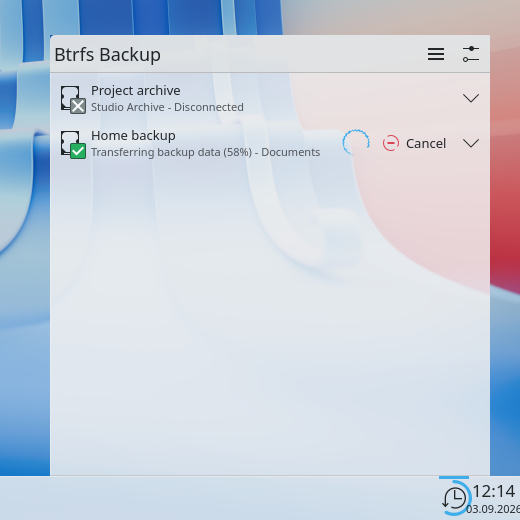
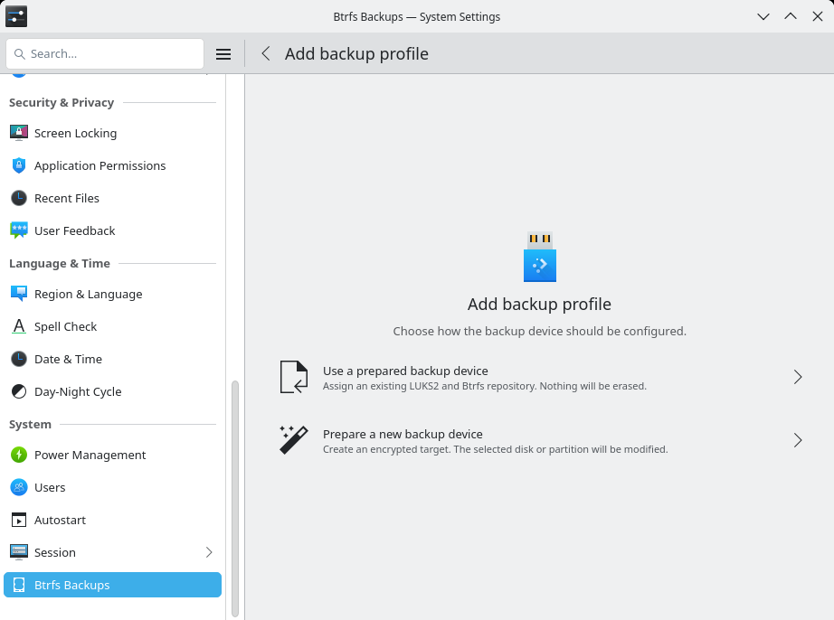
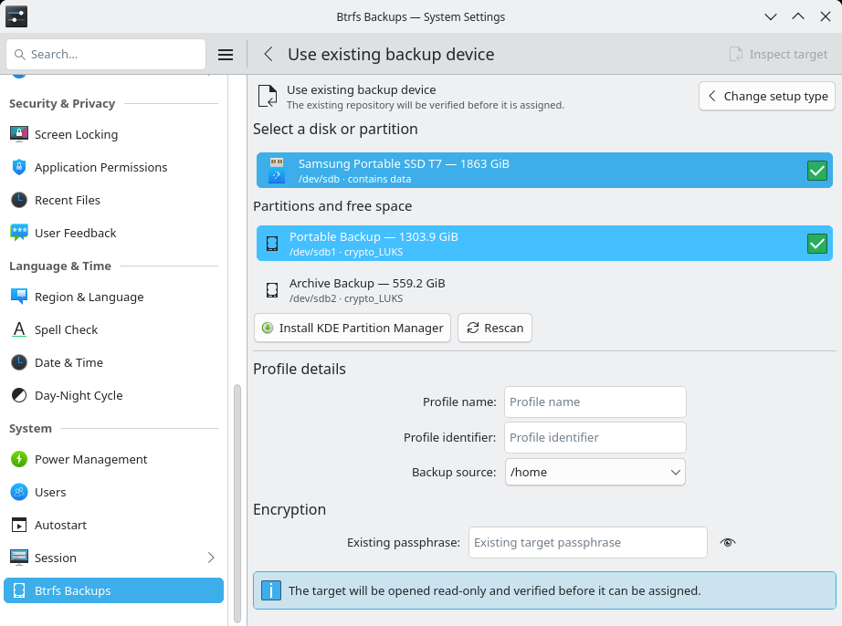
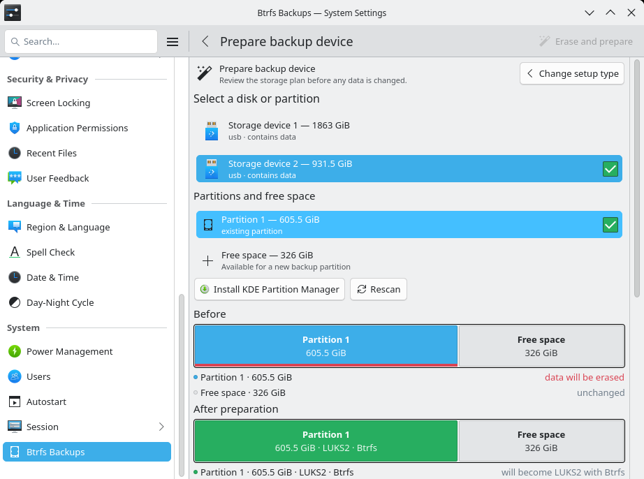
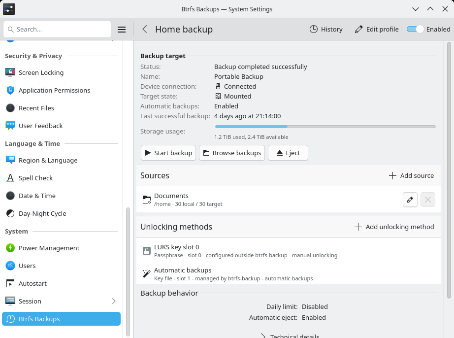
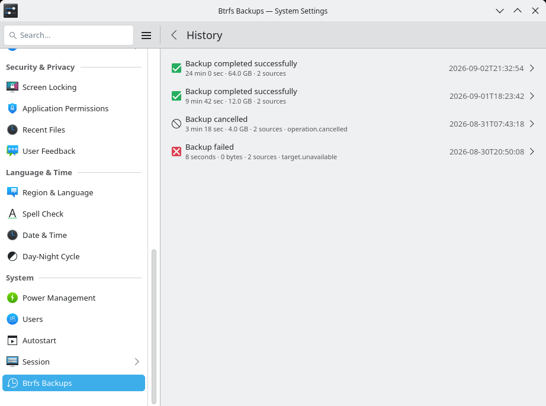
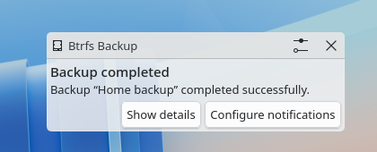
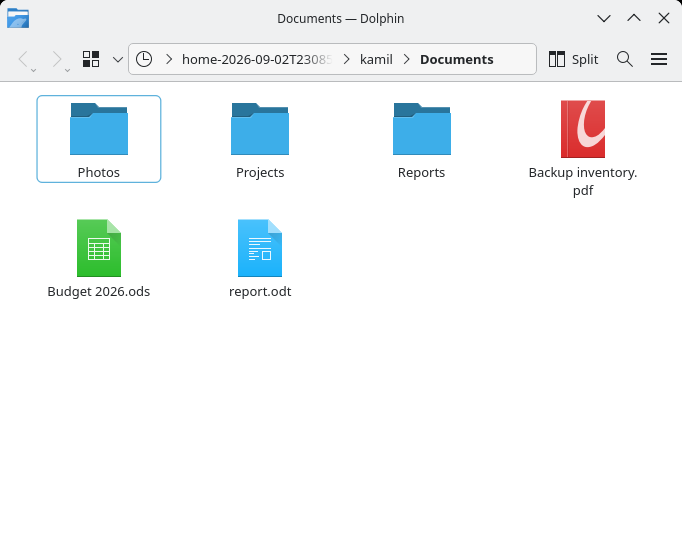
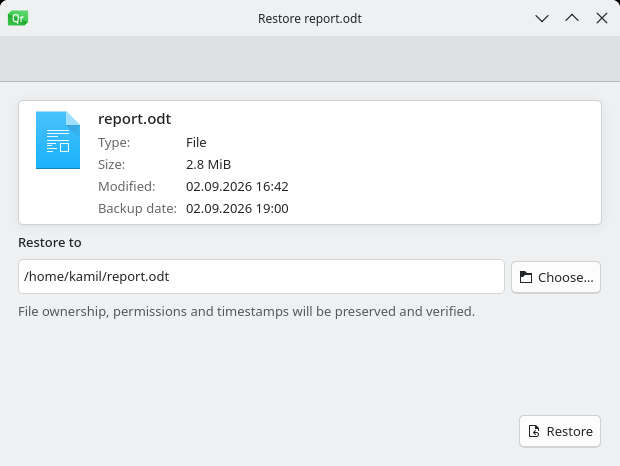

# btrfs-backup

`btrfs-backup` creates unattended, incremental backups of Btrfs subvolumes on
an encrypted removable disk. Connect the configured drive, let udev and systemd
run the backup, then safely disconnect it when the job finishes.

The core runtime works without a desktop. An optional KDE package adds setup in
System Settings, live progress, notifications, backup browsing in Dolphin and a
guided restore application.

[](docs/images/plasma-widget-transferring.png)

*Monitor transferred data, speed, remaining time and target state directly from
the Plasma panel.*

## What You Get

- full and incremental `btrfs send/receive` with UUID-based parent selection;
- read-only local and target snapshots with independent retention policies;
- safe interrupted-transfer recovery through `.incoming` snapshots and
  `pending` markers;
- exact LUKS device matching, mapper validation, free-space checks and
  controlled unmount and LUKS closure;
- multiple backup sources and profiles;
- passwordless per-profile control over automatic backups from Plasma and
  System Settings;
- CLI repository discovery, version browsing and transactional restore;
- an optional system D-Bus manager with sanitized status and Polkit-protected
  administration;
- optional Plasma, System Settings, Dolphin, KIO and KRunner integration.

## Install On Arch Linux

The stable release line is 0.3.x. The `master` branch and the package names
below describe the unreleased 1.0 development line; build them from this
checkout only for testing. Install the base development package with:

```bash
sudo pacman -U btrfs-backup-1.0.0-1-x86_64.pkg.tar.zst
```

For the KDE desktop tools, install the matching development package:

```bash
sudo pacman -U btrfs-backup-kde-1.0.0-1-x86_64.pkg.tar.zst
```

The base package installs the systemd and udev templates but does not enable a
backup or create an active profile. The KDE package does not become a runtime
dependency of unattended backups.

## Quick Start

### KDE Plasma

Open **System Settings → Btrfs Backups → Add Backup Profile**. The guided setup
can adopt a compatible removable LUKS2/Btrfs repository or prepare a selected
disk, partition, or unallocated region. It shows the exact destructive scope
and requires a separate explicit choice before erasing data.

After saving the profile, connect the configured drive. The Plasma widget and
session monitor show progress, errors, target capacity and when the device is
safe to disconnect. Test a restore from Dolphin or the guided restore
application before relying on the setup.

### Server Or A System Without KDE

#### 1. Prepare A Profile

Start by rendering the proposed configuration into a normal directory:

```bash
btrfs-backupctl profile wizard \
  --render-only \
  --output-dir "$PWD/generated"
```

The wizard detects connected LUKS devices and mounted Btrfs sources. Review the
generated profile and systemd files before installing them.

#### 2. Install The Profile

Run the wizard in apply mode when the generated configuration is correct:

```bash
sudo btrfs-backupctl profile wizard --apply
```

The active profile is stored at
`/etc/btrfs-backup/profiles/default/profile.json`. The wizard also installs the
matching mount, service and udev units. It does not edit `/etc/crypttab` or
`/etc/fstab`.

For unattended unlock, select a root-owned key file with mode `0600`.
`askPassword` instead uses the systemd password agent and requires someone to
provide the passphrase.

#### 3. Connect The Backup Drive

Do not enable `btrfs-backup@default.service`. The unit is intentionally started
by udev only when the exact configured LUKS partition appears.

Follow the first run with:

```bash
journalctl -u btrfs-backup@default.service -f
```

Package upgrades do not rewrite administrator-owned profiles or regenerate
their derived systemd and udev artifacts. After an upgrade that changes those
artifacts, run the maintenance step explicitly:

```bash
sudo btrfs-backupctl profile regenerate --all
sudo systemctl daemon-reload
sudo udevadm control --reload-rules
sudo systemctl try-restart btrfs-backupd.service
```

After a successful run, test a restore before treating the setup as complete.

## Everyday Commands

```bash
# Inspect profiles and status
btrfs-backupctl profile list
btrfs-backupctl profile show --profile default
btrfs-backupctl status show --profile default --human
btrfs-backupctl status history --profile default --limit 10

# Validate or start a backup manually
sudo btrfs-backup --profile default --validate
sudo btrfs-backup --profile default
sudo btrfs-backup --profile default --force

# Manage the target
sudo btrfs-backupctl target mount --profile default
sudo btrfs-backupctl target eject --profile default
```

Useful service logs:

```bash
journalctl -u btrfs-backup@default.service
journalctl -u btrfs-backupd.service
```

## Restore A Backup

The restore workflow is read-only until an explicit execute step. First inspect
a mounted repository:

```bash
btrfs-backupctl restore catalog \
  --repository /mnt/btrfs-backup/default/btrfs-backup
btrfs-backupctl restore list \
  --repository /mnt/btrfs-backup/default/btrfs-backup
btrfs-backupctl restore versions \
  --repository /mnt/btrfs-backup/default/btrfs-backup \
  --source Documents/report.odt
```

Then create and review a restore plan before executing it. The CLI refuses
dangerous destinations by default and commits replacements transactionally.
The KDE package exposes the same engine through Dolphin, the read-only
`btrfsbackup:` KIO worker and the guided restore application.

See [the recovery guide](docs/recovery.md) for complete plan and execute
examples, repository layout details and disaster-recovery procedures.

## KDE Desktop Integration

The optional `btrfs-backup-kde` package provides:

- a Plasma widget for profile state, progress, transfer rate and target usage;
- a session monitor for native progress and terminal notifications;
- a System Settings page for profile administration and target validation;
- read-only repository browsing through KIO and Dolphin previous versions;
- a guided restore application using the same transactional restore engine;
- KRunner commands for common backup operations.

Starting, cancelling, ejecting and changing automatic activation for an already
configured profile are available to the active local desktop session without a
password. Other profile changes and validation use Polkit; hook changes require
a separate high-risk authorization. Inspecting cached target capacity never
unlocks or mounts the drive.

### Configure A Backup Target

Start by choosing whether to reuse an existing encrypted backup target or let
the guided workflow prepare a removable device.

[](docs/images/system-settings-new-profile.png)

An existing removable LUKS/Btrfs target is inspected read-only before it can be
assigned. Only compatible, non-system devices are offered.

[](docs/images/system-settings-new-profile-adopt-partition.png)

When preparing a partition, the KCM shows the proportional layout before and
after the operation and marks the exact destructive scope before anything is
written.

[](docs/images/system-settings-new-profile-prepare-partition.png)

### Manage And Monitor Backups

The profile page brings together target state, capacity, backup sources,
unlocking methods and the actions that are currently safe to perform.

[](docs/images/system-settings-profile-details.png)

History distinguishes successful, cancelled and failed runs and reports their
duration and transferred data. Plasma then provides a native completion
notification without requiring the KCM to remain open.

[](docs/images/system-settings-history.png)

[](docs/images/notification-completed.png)

### Browse And Restore

Available repositories can be opened read-only through the `btrfsbackup:` KIO
worker. The manager activates the target when needed, while files and
directories remain normal Dolphin items and the device lifecycle stays under
manager control.

[](docs/images/dolphin-browse.png)

The guided restore application lets the user choose a destination, preview the
transactional plan and explicitly start the restore.

[](docs/images/restore-dialog.png)

The screenshots use sample data and are rendered deterministically from the
repository in an isolated KDE container with
[`python3 tools/screenshots/render.py container`](tools/screenshots/render.py).

## How Backups Stay Consistent

Each source must be a Btrfs subvolume, and its local snapshot directory must be
on the same Btrfs filesystem. The target must be a separate Btrfs filesystem
inside LUKS.

For every transfer, `btrfs-backup`:

1. creates or selects a read-only source snapshot;
2. chooses an incremental parent by Btrfs UUID identity, not by filename;
3. receives into an uncommitted `.incoming` location;
4. verifies the received UUID before committing the target snapshot;
5. records private history and reduced public status;
6. applies retention, syncs, unmounts and closes the LUKS mapping.

Profile and target locks prevent overlapping runs. Path, filesystem, mapper and
device checks reject common configuration and substitution mistakes.

## Requirements

The primary target is Arch Linux and its derivatives. The native runtime needs:

- Linux 6.0 or newer;
- `btrfs-progs` 6.0 or newer;
- systemd and udev;
- cryptsetup, coreutils and util-linux.

Transfers always use send protocol v2 with
`btrfs send --proto 2 --compressed-data`. Linux 6.0 also provides the encoded
write ioctl used by `btrfs receive` for compressed extents.

Source builds additionally need CMake 3.20+, a C++23 compiler, pkg-config,
nlohmann-json and development files for libmount, libblkid, libcryptsetup,
libudev and libbtrfsutil. Build the base package with:

```bash
cmake --preset default -DCMAKE_INSTALL_PREFIX=/usr
cmake --build --preset default --parallel
```

`BUILD_SYSTEM_MANAGER` is enabled by default. It additionally requires libfdisk
and libsystemd development files and builds the privileged `btrfs-backupd`
system D-Bus service, the isolated `btrfs-backup-device-preparation` helper,
their systemd units, and D-Bus and polkit integration. The manager exposes
sanitized status plus separately authorized backup control, profile,
credential, browse-session, and destructive device-provisioning operations; it
does not execute backup transfers. Pass `-DBUILD_SYSTEM_MANAGER=OFF` for a
runner-and-CLI-only build.

Pass `-DBUILD_KDE_INTEGRATION=ON` to build the optional desktop package. It
requires Qt 6 Core, DBus, Gui, QML and Quick, Extra CMake Modules, Plasma and
KF6 CoreAddons, I18n, JobWidgets, KCMUtils, Notifications, Package, KIO and
Runner development files.

## Upgrading To 1.0

Version 1.0 accepts only canonical profile schema v4 and requires
`configurationGeneration`. Legacy profile schemas, automatic profile migration
and old activation markers have been removed from normal runtime loading. Before
replacing an existing installation, run the read-only release gate and create a
new, non-overwriting migration backup:

```bash
sudo btrfs-backupctl upgrade preflight
sudo btrfs-backupctl profile export-v4 --all \
  --output-dir /root/btrfs-backup-before-1.0
```

`export-v4` validates every profile before publishing anything, explicitly
converts profile schemas 1 through 3 to v4, and copies the optional global
`btrfs-backup.conf`. It does not modify the installed configuration and does not
copy referenced key files. Back those up separately. The output directory must
not already exist.

If preflight reports an old schema, save the exported v4 profiles while the
0.3.x installation is still active, then repeat preflight:

```bash
sudo btrfs-backupctl profile save \
  --file /root/btrfs-backup-before-1.0/profiles/default/profile.json
sudo btrfs-backupctl upgrade preflight
```

Do not install 1.0 until the final summary is `READY`. After upgrading, retain
the export until a backup and restore test have both succeeded. `RESTORE.txt`
inside the export records the recovery command. Arch, DEB, RPM and Gentoo
upgrades run the same read-only gate before replacing the installed binary. A
direct upgrade from a release without the command is stopped and requires the
latest 0.3.x migration bridge first.

Read the [1.0 changelog](CHANGELOG.md) and the
[configuration guide](docs/configuration.md) before upgrading an existing
installation.

## Documentation

- [Architecture and runtime flow](docs/architecture.md)
- [Configuration reference](docs/configuration.md)
- [Recovery guide](docs/recovery.md)
- [Security model](docs/security.md)
- [Status API](docs/status-api.md) and [system D-Bus API](docs/system-dbus-api.md)
- [KDE integration](docs/plasma-integration.md)
- [Development workflow](docs/development.md), [testing](docs/testing.md) and
  [contributing](CONTRIBUTING.md)
- [Release and packaging](docs/packaging.md)
- [Product roadmap](ROADMAP.md) and [current task status](TODO.md)
- [Architecture decisions](docs/adr/) and [implemented designs](docs/design/)

## Security And Limits

Active profiles are trusted root-owned configuration and must use mode `0600`.
The runtime validates the target at several levels, but it does not replace a
3-2-1 backup strategy. Removable media reduces exposure; it cannot protect
against every hardware failure, theft, administrator mistake or corruption of
both copies.

Automated tests use controlled command mocks. Before production use, run the
real-Btrfs integration test and perform a restore drill. Report suspected
vulnerabilities privately as described in [SECURITY.md](SECURITY.md).

## License

GPL-0.3-or-later. See [LICENSE](LICENSE).
