# Architecture

## Goal

The project backs up one or more Btrfs subvolumes to a removable Btrfs disk placed inside LUKS. The disk can stay unmounted and closed most of the time.

The source tree follows runtime responsibilities rather than abstract layers:
configuration, state, backup orchestration, Linux adapters, and CLI presentation
are separate CMake components. Their ownership and dependency direction are
defined in [C++ source layout](cpp-layout.md). The optional system daemon is
an outer adapter over presentation-safe configuration and state; it does not
duplicate command parsing or backup logic. Runner execution remains independent
of the daemon as recorded in
[ADR 0004](adr/0004-runner-independent-of-daemon.md).

## Runtime Flow

```mermaid
flowchart TB
    device[Matching LUKS partition appears]
    udev[udev sets SYSTEMD_WANTS for the profile service]
    dropin[Profile drop-in declares RequiresMountsFor]
    mount[systemd starts the fstab mount and cryptsetup dependency]

    device --> udev --> dropin --> mount

    subgraph runner[btrfs-backup profile service]
        direction TB
        lock[Acquire profile and target locks]
        daily[Check daily limit and configuration fingerprint]
        target[Validate LUKS, mapper, Btrfs, and mount point]
        filesystems[Verify source and target filesystem separation]

        subgraph source[For each enabled source]
            direction TB
            paths[Validate target paths and symlinks]
            recover[Recover pending state]
            snapshot[Create local read-only snapshot]
            parent[Select incremental parent by UUID]
            receive[Receive into .incoming]
            verify[Verify read-only state and Received UUID]
            commit[Commit target snapshot]
            retention[Apply local and remote retention]

            paths --> recover --> snapshot --> parent --> receive --> verify --> commit --> retention
        end

        finish[Sync target and write last-success]
        lock --> daily --> target --> filesystems --> paths
        retention --> finish
    end

    mount --> lock

    schedule[OnSuccess or OnFailure schedules the profile eject service]

    subgraph eject[eject service]
        direction TB
        eject_sync[Sync target]
        unmount[Unmount expected target]
        mapper_check[Check remaining mapper mounts]
        crypt_stop[Stop matching systemd-cryptsetup unit]
        removable[Report that media can be disconnected]

        eject_sync --> unmount --> mapper_check --> crypt_stop --> removable
    end

    finish --> schedule --> eject_sync
```



## Single Startup Source

The udev rule is only responsible for starting the service on an `add` event. There is no removal handler because after physical device removal it is too late to safely flush buffers and unmount.

Each saved profile installs a service drop-in with
`RequiresMountsFor=<TARGET_MOUNT_ROOT>/<profileId>`. The mount root defaults to
`/mnt/btrfs-backup` and is controlled only by the global application
configuration. PID 1 therefore starts the fstab mount,
including its cryptsetup dependency, before it creates the service's private
mount namespace. The mount unit does not start the backup service, so there is
no `service -> mount -> service` dependency cycle. A runner started directly
from the command line retains the explicit mount-start fallback.

The service templates have no `[Install]` section and are not intended to be enabled with `systemctl enable`.
The ownership of mount activation and eject ordering is recorded in
[ADR 0002](adr/0002-systemd-owns-mounts.md).

The runner executes in a systemd filesystem, process and system-call sandbox.
The service keeps device access and the root capabilities
needed by the current Btrfs/LUKS path, while making `/usr`, `/boot` and `/etc`
read-only, isolating temporary files, hiding unrelated processes, blocking new
privilege acquisition and writable-executable mappings, and limiting sockets to
`AF_UNIX` and `AF_NETLINK`. The runner validates the target mounted by PID 1
from inside that namespace before it performs any repository operation.

The filesystem sandbox makes service mount changes private. `OnSuccess` and
`OnFailure` queue the short-lived eject unit after the runner reaches its final
state and has left that namespace. The unit performs the host unmount and LUKS
closure without a private mount namespace, while retaining the restrictions
that do not interfere with the target lifecycle.

## Runner And Target Locks

Every executing runner holds two non-blocking `flock` locks before mounting or
inspecting the target:

```text
/run/btrfs-backup/locks/profiles/<PROFILE_ID>.lock
/run/btrfs-backup/locks/targets/<LUKS_UUID>.lock
```

The profile lock rejects concurrent service and CLI runs for one profile. The
target lock serializes different profiles that reference the same encrypted
backup repository. Target mount and eject commands use the same target lock, so
an automatic eject cannot unmount a target after another runner has started.

Locks are acquired in profile-then-target order and are held through validation,
daily-limit handling, execution, status/history writes, and `last-success`.
Contention fails immediately and does not overwrite the active runner's status.

Profile installation uses the same per-profile lock. It first writes all
derived artifacts to same-directory staging files and validates both JSON
documents. Under the lock it publishes the udev rule and systemd drop-in, then
the private profile, reloads systemd and udev, and finally publishes the reduced
public profile as the commit marker. A failure rolls every replaced file back
and attempts to reload the previous rules. All four artifacts carry one random
`configurationGeneration`; the service drop-in passes that generation to the
runner, which rejects a private profile from another generation. This makes a
process or host failure between individual filesystem renames fail closed even
though Linux cannot atomically rename files across these separate directories.

## Runner And Manager Boundary

The backup runner remains executable directly by the system service started
from the device event. The optional long-lived manager exposes sanitized query
APIs and authorized start, cancel, validate, and eject controls, but it is not a
required process for an already configured automatic backup to run.

If the manager is unavailable or restarts, an active runner continues. The
manager reconstructs visible state from `/run/btrfs-backup` status files and
history under `/var/lib/btrfs-backup` instead of owning the only copy of runtime
state.

The manager's authorization boundary is specified in
[system-dbus-api.md](system-dbus-api.md). Read-only methods expose sanitized
data; every privileged operation has a distinct polkit action. Profile saves
that change hooks additionally require the dedicated hook-change action because
they can schedule code to run as root.

## Process Creation

The decision to keep Btrfs stream production and consumption in external
processes is recorded in
[ADR 0001](adr/0001-btrfs-send-external-process.md).

The runner has active cancellation and transfer worker threads. Both synchronous
administrative commands and asynchronous transfer processes are therefore
created through a shared `posix_spawn()` adapter. Bare program names are mapped
to `/usr/bin` and relative program paths are rejected. Child environments are
built from an allowlist containing only `PATH=/usr/bin`, `LANG=C.UTF-8`,
`LC_ALL=C.UTF-8`, and `HOME=/root`. Hooks additionally receive the explicit
`BTRFS_BACKUP_PROFILE_ID` and `BTRFS_BACKUP_SOURCE_ID` context for their current
action. All synchronous commands use the same nonblocking controlled executor;
the default policy is a 30-second timeout and at most 1 MiB of captured output.
Operations with a justified longer bound specify it explicitly, such as the
five-minute target synchronization during eject. Transfer file descriptors are
wired with `posix_spawn_file_actions`, and each producer and consumer starts in
its own process group through `POSIX_SPAWN_SETPGROUP`. The existing poll-based
transfer loop retains ownership of streaming, diagnostics, cancellation, and
child reaping without running allocator or other C++ code in a post-fork child.
The producer stream is moved directly between the producer stdout pipe and the
consumer stdin pipe with nonblocking `splice(2)`. Payload bytes do not enter the
runner's userspace memory, while each successful splice still supplies an exact
byte count for progress reporting. Kernel pipe capacity provides bounded
backpressure when the consumer is slower. Readiness latches prevent a busy loop
when only one side can make progress, and the poll loop retains ownership of
diagnostics, cancellation, and child reaping.

Transfer sizing uses the same bounded pipeline before the effectful receive.
The first pass runs the identical `btrfs send` argument vector into
`btrfs receive --dump`; its byte count becomes the exact total for the second
pass.
Sizing progress remains indeterminate and is excluded from transferred byte
totals. Both passes use the same cancellation and child-reaping policy.

`SIGINT` and `SIGTERM` are blocked before runner worker threads start and are
consumed through `signalfd`. Both signals request the same platform-neutral
`CancellationToken` as the file-based cancellation command. Linux process
adapters attach a `PosixCancellationSignal` when they need to wake `poll()`;
the token itself does not expose file descriptors. Transfer cancellation closes
the data pipes and sends `SIGTERM` to both child process groups. A child that remains
alive after 5 seconds receives `SIGKILL`; the pipeline then allows another 5
seconds for `waitpid` before it stops waiting for an uninterruptible child. This
bounds asynchronous handle destruction while preserving normal child reaping.
Spawned commands receive an empty signal mask and default SIGINT, SIGTERM, and
SIGPIPE dispositions rather than inheriting the runner's signal integration.
Every successful spawn is immediately owned by a move-only `ChildProcess` RAII
guard. Normal wait paths disarm the guard after `waitpid`; exception unwinding
uses the same bounded SIGTERM, SIGKILL, and reap policy, including failures
between producer and consumer startup or while configuring transfer pipes.

Application hooks use the same cancellation token. Each hook runs in a separate
process group with its required configured timeout. Cancellation or timeout
sends SIGTERM to the group; process RAII escalates to SIGKILL and performs
bounded reaping when the group does not exit. Hook stdout and stderr are drained
while captured diagnostics are limited to 64 KiB. Production hooks are opened
without symlinks below `/etc/btrfs-backup/hooks.d`, checked for root ownership
and non-writable trusted parents, then spawned through an inherited
`/proc/self/fd/<fd>` path. Keeping that descriptor alive through `posix_spawn()`
prevents a path replacement race between validation and execution.

## Commit Model

Each receive first lands under:

```text
<INCOMING_ROOT>/<SOURCE_NAME>/<RUN_ID>/
```

After the transfer completes, the runtime verifies:

1. the expected subvolume exists;
2. it is read-only;
3. the local snapshot UUID matches the target-side `Received UUID`.

Only then is the subvolume moved into the final snapshot directory. The move happens on the same Btrfs filesystem, so data is not copied again.

## Interrupted Runs

Before creating a local snapshot, the runtime writes a private `pending-<source>` file in the profile state directory under `STATE_DIR/profiles/<PROFILE_ID>`. The marker records both the local snapshot path and its planned final target path. On the next run, it:

1. checks whether the local snapshot still exists;
2. removes a snapshot left at that exact final path if its `Received UUID` does not match the pending local snapshot;
3. searches the target for a subvolume with a matching `Received UUID`;
4. preserves the local snapshot if the remote commit already happened;
5. removes an orphaned snapshot or keeps it according to `KEEP_FAILED_LOCAL_SNAPSHOT`;
6. cleans stale `.incoming` data.

If the target becomes unavailable while handling an error, the local snapshot and pending marker are preserved. The next successful target connection resolves them.
If final-snapshot verification and its immediate cleanup both fail, the run
reports `repository.recovery_required`; recovery keeps the marker until the
invalid final snapshot and any configured local cleanup have succeeded.

## Incremental Parent

Snapshot names are used for sorting and display. A parent is considered common only when the local snapshot UUID equals the `Received UUID` of a target snapshot. This prevents using an unrelated directory with the same name.

## Daily Limit

`last-success` is written in the profile state directory only after all sources complete, the target is synchronized, and retention is applied. It contains the date, profile id, profile name, target LUKS UUID, and SHA-256 fingerprint of the active profile JSON. Changing the configuration forces a new run even on the same day.

## Filesystem and Path Boundaries

For each source, the runtime compares the Btrfs filesystem UUID and falls back to the device number if the UUID is unavailable. The source and local snapshot directory must belong to the same Btrfs filesystem, while the source and target must belong to different filesystems.

Production filesystem effects are anchored by `SafeDirectoryRoot` descriptors.
Each path component is opened with `openat2()` using `RESOLVE_BENEATH`,
`RESOLVE_NO_SYMLINKS`, and `RESOLVE_NO_MAGICLINKS`. Directory creation,
recursive incoming cleanup, recovery, retention, snapshot creation, metadata
verification, and commit therefore operate beneath an already opened root
rather than resolving an absolute pathname again. Btrfs subvolume deletion uses
`BTRFS_IOC_SNAP_DESTROY` on the securely opened parent dirfd. A symbolic link in
any repository or local-snapshot path component aborts the run. Snapshot
inventory is scanned through pinned directory descriptors. `btrfs send` and
`btrfs receive` inherit pinned descriptors for the snapshot, incremental parent,
and receive directory and address them through `/proc/self/fd`.
