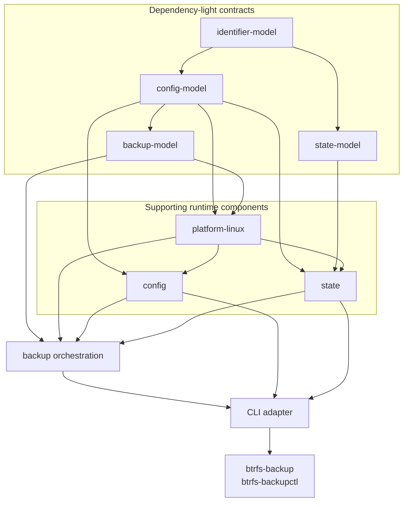

# C++ Source Layout

The native code is organized by domain and responsibility. Headers live beside
their implementations because this repository builds an application, not a
public C++ SDK.

```text
apps/                         # small executable entry points
src/
├── backup/                   # planning, execution, snapshots, transfer, recovery
├── config/                   # profile model, validation, storage, rendering
│   └── wizard/               # interactive profile construction
├── state/                    # status, checkpoints, fingerprints, history reads
├── platform/linux/           # explicitly Linux-specific system integration
└── cli/                      # argv parsing, presentation, exit-code mapping
tests/
├── unit/{backup,config,state,platform,cli}/
├── integration/
├── support/
└── systemd/
data/{examples,schemas,systemd}/
integrations/kde/             # optional desktop integration
```

Directories describe what code does. Architectural boundaries are enforced by
CMake targets and their declared dependencies:



The `*-model` targets contain dependency-light contracts needed to avoid
cycles between configuration, backup concepts, and Linux implementations. They
are implementation details of the domain layout, not separate source trees.
`btrfsbackup-identifier-model` contains the validated `ProfileId`, `RunId`, and
`SourceId` value types shared by those contracts without pulling in JSON or
filesystem adapters.

## Ownership

- `backup` owns run planning and execution, incremental-parent selection,
  transfer orchestration, snapshot commit, retention, recovery, cancellation,
  target operations, and backup use cases.
- `config` owns the canonical profile JSON model, validation, profile loading
  and storage, installation rendering and validation, and the profile wizard.
- `state` owns configuration fingerprints, JSON checkpoint persistence,
  file-backed current status and history, status history reads, and the public
  status contract. It implements the event and checkpoint interfaces declared
  by `backup`; the executor never writes those files directly.
  `btrfsbackup-state-model` exposes the typed `RunStatus`, `RunProgress`, and
  optional `RunError` contract without depending on JSON or filesystem code.
- `platform/linux` owns POSIX processes, Btrfs and block-device integration,
  mount inspection, trusted files, locks, durable filesystem operations, and
  other Linux-specific effects.
- `cli` owns command-line parsing, output formatting, interactive streams, and
  exit-code mapping. Reusable orchestration must remain outside this target.
- `apps` owns only process entry points and dependency composition.

## Rules

1. Put a component's `.hpp` and `.cpp` files together in the owning domain.
   Include internal headers through paths such as `<backup/backup_service.hpp>`
   or `<platform/linux/process.hpp>`.
2. Reserve a future top-level `include/` directory for an intentionally public,
   versioned SDK. Do not mirror internal headers there.
3. Each unit test belongs to the domain it exercises and links the narrowest
   target that provides the tested contract. Cross-domain file contracts belong
   under `tests/integration/`.
4. Keep Linux-specific effects under `src/platform/linux/`. Pure configuration,
   state, and planning code must not acquire UI or desktop dependencies.
5. Invoke external programs without a shell. Pass executable and arguments
   separately through the shared command/process abstractions.
6. Keep long-running transfer orchestration separate from short administrative
   commands. Cancellation and completion remain pollable runtime events.
7. Keep root-only state and history separate from sanitized public status.
8. Do not add empty directories for planned daemon, QEMU, or KDE components.
   Add them only with the first implementation they own.
9. Optional KDE code remains under `integrations/kde` and outside the base
   runtime dependency graph.

Application-facing functions such as `plan_backup`, `start_backup`,
`cancel_backup`, `mount_target`, `eject_target`, `save_profile`, `get_statuses`,
and `render_installation` accept typed requests and results. They do not depend
on command-line arguments, output streams, presentation rules, or process exit
codes, so future D-Bus and KDE adapters can use the same behavior.

New backup and state contracts use `ProfileId`, `RunId`, and `SourceId` rather
than interchangeable strings. Run lifecycle, phase, and error codes are enums.
CLI and JSON adapters perform the explicit conversion to their stable textual
representations; older persistence and configuration structures can migrate
incrementally when their owning boundary changes.
