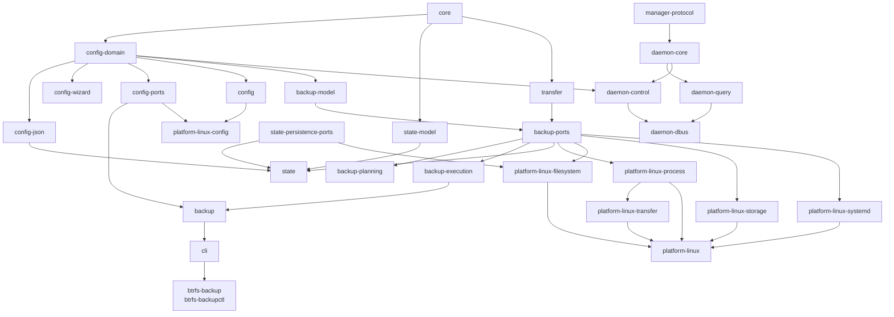

# C++ Source Layout

Local file organization, lifecycle, and ownership rules are documented in
[`cpp-readability.md`](cpp-readability.md).

The native code is organized by domain and responsibility. Headers live beside
their implementations because this repository builds an application, not a
public C++ SDK.

```text
apps/                         # small executable entry points
src/
├── core/                     # identifiers, errors, cancellation and shared runtime/protocol primitives
├── backup/                   # backup use-case facade
│   ├── model/                # run plans, typed actions, events, snapshots and retention
│   ├── ports/                # platform-neutral application contracts
│   ├── planning/             # discovery, preflight and plan construction
│   ├── execution/            # run lifecycle and action handlers
│   │   └── actions/          # technical grouping; still execution namespace
│   └── transfer/             # transfer model plus snapshot transfer coordination
├── config/                   # profile services and rendering
│   ├── domain/               # typed profile data and validation
│   ├── json/                 # JSON profile adapter
│   ├── ports/                # configuration contracts
│   └── wizard/               # interactive profile construction
├── state/                    # one state domain, physically grouped by role
│   ├── model/
│   ├── persistence/
│   ├── cancellation/
│   ├── projection/
│   └── query/
├── platform/linux/           # explicitly Linux-specific system integration
│   ├── process/
│   ├── filesystem/
│   ├── storage/
│   ├── transfer/
│   ├── systemd/
│   └── config/
├── cli/                      # command entry adapters
│   ├── runner/
│   ├── profile/
│   ├── status/
│   └── target/
└── daemon/                   # optional authorized system D-Bus adapter
    ├── query/
    ├── control/
    └── dbus/
tests/
├── unit/{backup,config,state,platform,cli,daemon}/
├── integration/
├── support/
└── systemd/
data/{examples,schemas,systemd,udev}/
integrations/kde/             # optional desktop integration
```

## Namespaces

The source directory and C++ namespace describe the same owner. Shared core
types remain directly in `btrfsbackup`; domain code uses the following map:

| Source directory | Namespace |
|---|---|
| `src/core/` | `btrfsbackup` |
| `src/config/` | `btrfsbackup::config` |
| `src/config/domain/` | `btrfsbackup::config` |
| `src/config/json/` | `btrfsbackup::config::json` |
| `src/config/ports/` | `btrfsbackup::config` |
| `src/config/wizard/` | `btrfsbackup::config::wizard` |
| `src/backup/` | `btrfsbackup::backup` |
| `src/backup/model/` | `btrfsbackup::backup` |
| `src/backup/ports/` | `btrfsbackup::backup` |
| `src/backup/planning/` | `btrfsbackup::backup::planning` |
| `src/backup/execution/` | `btrfsbackup::backup::execution` |
| `src/backup/execution/actions/` | `btrfsbackup::backup::execution` |
| `src/backup/transfer/` | `btrfsbackup::backup::transfer` |
| `src/state/**` | `btrfsbackup::state` |
| `src/platform/linux/` | `btrfsbackup::platform::linux` |
| `src/platform/linux/process/` | `btrfsbackup::platform::linux::process` |
| `src/platform/linux/filesystem/` | `btrfsbackup::platform::linux::filesystem` |
| `src/platform/linux/storage/` | `btrfsbackup::platform::linux::storage` |
| `src/platform/linux/transfer/` | `btrfsbackup::platform::linux::transfer` |
| `src/platform/linux/systemd/` | `btrfsbackup::platform::linux::systemd` |
| `src/platform/linux/config/` | `btrfsbackup::platform::linux::config` |
| `src/cli/` | `btrfsbackup::cli` |
| `src/cli/runner/` | `btrfsbackup::cli::runner` |
| `src/cli/profile/` | `btrfsbackup::cli::profile` |
| `src/cli/status/` | `btrfsbackup::cli::status` |
| `src/cli/target/` | `btrfsbackup::cli::target` |
| `src/daemon/` | `btrfsbackup::daemon` |
| `src/daemon/query/` | `btrfsbackup::daemon::query` |
| `src/daemon/control/` | `btrfsbackup::daemon::control` |
| `src/daemon/dbus/` | `btrfsbackup::daemon::dbus` |

A directory, namespace, and CMake target answer different questions. A
directory improves navigation, a namespace names a stable language or adapter,
and a target enforces a dependency boundary. Therefore technical directories
such as `model`, `ports`, `execution/actions`, and every directory below
`state` do not add namespaces. Conversely, `config/json`, `config/wizard`, and
the Linux adapters do because their qualified names identify stable boundaries.
The `namespace-layout` architecture test applies the longest matching directory
prefix and rejects namespace-wide using directives.

Directories describe what code does. Architectural boundaries are enforced by
CMake targets and their declared dependencies:



Arrows show direct public link interfaces; private and third-party dependencies
are omitted. In particular, `btrfsbackup-backup` is platform-neutral: Linux and
file-backed adapters meet it only in the CLI composition root.

The `*-model` targets contain dependency-light contracts needed to avoid
cycles between configuration, backup concepts, and Linux implementations. Their
`model` directories are physical ownership aids and do not add namespaces.
Configure-time architecture checks reject unexpected target dependencies and
JSON, Linux, D-Bus, or UI includes in the model and transfer targets. The same
checks require every source header to have exactly one owning CMake target,
compile every public header in isolation, and use CMake File API data to ensure
that every project library is covered by the architecture manifest.
The `btrfsbackup-core` target contains the validated `ProfileId`, `RunId`, and
`SourceId` value types and the shared error hierarchy. Those contracts can be
used by configuration, backup, state, and platform adapters without pulling in
JSON or filesystem implementations.

The header-only `btrfsbackup-manager-protocol` target owns the stable D-Bus
identity, API and schema versions, capability names, methods, and signals. It
has no Qt, JSON, systemd, or runtime dependency and is shared by the daemon and
the optional KDE client. Transport-specific DTOs and codecs remain in their
respective adapters.

## Ownership

- `core` owns identifiers, the shared error hierarchy, platform-neutral
  cancellation state, and other shared runtime primitives.
- `backup` owns the single-execution `BackupRun`, run planning and execution,
  incremental-parent selection,
  transfer model and orchestration, snapshot commit, retention and recovery,
  target operations, and backup use cases.
- `config-domain` owns typed profile data and validation without a JSON
  dependency. The separate `config-json` adapter owns canonical profile parsing,
  serialization and document conversion. `config-wizard` owns general wizard
  values, while `platform-linux-config` owns Linux profile repositories,
  installation rendering, activation, validation, and device discovery.
- `state` owns configuration fingerprints, JSON checkpoint persistence,
  file-backed current status and history, status history reads, and the public
  status contract. It implements the event and checkpoint interfaces declared
  by `backup`; the executor never writes those files directly.
  `btrfsbackup-state-model` exposes the typed `RunStatus`, `RunProgress`, and
  optional `RunError` contract without depending on JSON or filesystem code.
- `platform/linux` owns POSIX processes, Btrfs and block-device integration,
  mount inspection, trusted files, locks, durable filesystem operations,
  transfer processes and `splice` pumping, poll wakeups for cancellation, and
  other Linux-specific effects.
- `cli` owns command-line parsing, output formatting, interactive streams, and
  exit-code mapping. Reusable orchestration must remain outside this target.
- `daemon` owns the versioned D-Bus adapter, authorization, and sanitization boundary.
  It observes file-backed state and never owns runner execution.
- `apps` owns only process entry points. The CLI runner adapter performs
  dependency composition after resolving its configuration and diagnostic
  options.

## Backup Application Service

`BackupService` is an application service over explicit ports. Profile loading,
mount inspection and activation, planning, run construction, locking, runtime
state, cancellation monitoring, clocks, and run-id generation are constructor
dependencies. Its public
`BackupRequest` carries only operation intent (`profileId`, `force`, and
`validateOnly`); filesystem paths, mount-table overrides, timestamps, and test
fixtures are adapter configuration rather than domain input. The CLI adapter
also owns selection of the default profile id; the request model does not
silently choose one.

The runner CLI is the composition boundary for the backup use case because it
resolves the selected configuration root and the diagnostic `plan` overrides.
It constructs the Linux and file-backed adapters and then invokes the same
`BackupService` constructor used by tests. The service itself does not select
between production and test behavior and does not instantiate `Posix*`,
`LibBtrfsOperations`, or JSON persistence implementations.

Run plans store actions as a `std::variant` of operation-specific types. Each
alternative owns exactly the inputs needed by that operation, and executors use
`std::visit` instead of interpreting shared path slots. `BackupRunActionKind`
remains only the stable action label used by events, checkpoints, and CLI JSON.

`BackupRunExecutor` sees one `IBackupActionExecutor` port. Its production
implementation delegates non-transfer effects to a small
`BackupRunActionHandler` dispatcher composed from snapshot, recovery, retention,
hook, and repository handlers. Each specialized
handler accepts only the action types and dependencies belonging to its own
effect group. `DefaultBackupRunActionHandlerFactory` owns this reusable,
run-scoped assembly in `backup`; the runner composition root supplies the Linux
and file-backed port implementations. Transfer execution remains a separate
coordinator owned by `backup`.

## Rules

1. Put a component's `.hpp` and `.cpp` files together in the owning domain.
   C++ filenames use `PascalCase` and match their primary type or precise
   module concept; `main.cpp` remains the conventional entry-point exception.
   Include internal headers through paths such as `<backup/BackupService.hpp>`
   or `<platform/linux/process/Process.hpp>`.
2. Reserve a future top-level `include/` directory for an intentionally public,
   versioned SDK. Do not mirror internal headers there.
3. Each unit test belongs to the domain it exercises and links the narrowest
   target that provides the tested contract. Cross-domain file contracts belong
   under `tests/integration/`.
4. Keep Linux-specific effects under `src/platform/linux/`. Pure configuration,
   state, and planning code must not acquire UI or desktop dependencies.
5. Invoke external programs without a shell. Pass executable and arguments
   separately through the shared command/process abstractions.
6. Keep long-running transfer orchestration separate from short administrative
   commands. Cancellation state and async completion remain platform-neutral;
   Linux adapters translate cancellation into pollable runtime events.
7. Keep root-only state and history separate from sanitized public status.
8. Do not add empty directories for planned QEMU or KDE components.
   Add them only with the first implementation they own.
9. Optional KDE code remains under `integrations/kde` and outside the base
   runtime dependency graph. It may depend on the header-only manager protocol,
   but not on daemon, backup, state, configuration, or Linux implementations.

Application-facing functions such as `plan_backup`, `start_backup`,
`cancel_backup`, `mount_target`, `eject_target`, `save_profile`, `get_statuses`,
and `render_installation` accept typed requests and results. They do not depend
on command-line arguments, output streams, presentation rules, or process exit
codes, so future D-Bus and KDE adapters can use the same behavior.

New backup and state contracts use `ProfileId`, `RunId`, and `SourceId` rather
than interchangeable strings. Run lifecycle, phase, and error codes are enums.
CLI and JSON adapters perform the explicit conversion to their stable textual
representations; older persistence and configuration structures can migrate
incrementally when their owning boundary changes.
