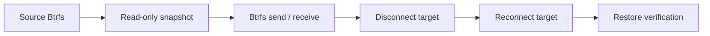

# Testing

See the [development workflow](development.md) for the canonical commands that
connect CMake presets, quality checks, privileged integration tests and release
validation.

## Automated Suite

The default local suite runs without real Btrfs devices:

```bash
cmake --preset gcc-debug
cmake --build --preset gcc-debug --parallel
ctest --preset gcc-debug --parallel
```

For fast feedback while editing tracked C++ implementation files, run:

```bash
make quality-changed
```

This checks formatting and runs clang-tidy only on implementation lines changed
since `HEAD`. Set `CLANG_TIDY_BASE=<commit>` to check a wider diff. Header-only
changes and the final pre-commit check still require the complete `make quality`
gate.

Public-header compile probes and dependency graph checks are enabled by default
and carry the CTest label `architecture`. CI runs them once in a dedicated
Clang job; compiler and sanitizer jobs configure with:

```bash
cmake --preset gcc-debug -DBTRFSBACKUP_ARCHITECTURE_TESTS=OFF
```

Run only the architecture contract with:

```bash
cmake --preset architecture
ctest --preset architecture --parallel "$(nproc)"
```

Tests cover:

1. unit-tested Python orchestration for the QEMU host and guest;
2. multi-source rendering without unresolved placeholders;
3. systemd unit and udev rule validation;
4. canonical profile JSON validation, rendering, save, show, and export;
5. per-profile status and history JSON.

The focused systemd security contract can also be run directly:

```bash
cmake --preset gcc-debug
ctest --preset gcc-debug -L systemd --parallel
```

It asserts the required directives and runs offline `systemd-analyze security`.
The backup runner and privileged device-preparation helper have separate
policies and maximum exposure levels of `8.0` and `4.5`, respectively. The
helper's policy explicitly accounts for its retained mount, block-device, and
storage-administration privileges. The GitHub Actions security job runs both
checks for every push and pull request.

The QEMU provisioning scenario also moves a probe into the live helper cgroup.
It proves that the selected disposable disk can be opened while a sibling disk
is denied by the kernel-enforced systemd device policy. Successful whole-device
provisioning additionally proves that access is extended to the concrete new
partition and mapper without a broad block-device class rule.

## Mock Boundaries

C++ unit tests cover the native backup entrypoint, target mount/eject commands,
planning, transfer orchestration, recovery, retention, status writing and
validation logic. Focused regression coverage includes:

1. concurrent runners for one profile, one shared LUKS UUID, and independent
   targets;
2. a 1 GiB producer/consumer stream under kernel-pipe backpressure;
3. bounded SIGTERM-to-SIGKILL escalation and child reaping after partial spawn
   or exception unwind;
4. durable-write failures for ENOSPC, EIO, file and directory `fsync`, close,
   rename, and EINTR;
5. file-request and SIGINT/SIGTERM cancellation through terminal `cancelled`
   status while recovery state remains available;
6. fractional aggregate progress during both the first and later sources;
7. trusted hook file type, ownership/mode policy, symlink rejection, inherited
   descriptor execution, and resistance to pathname replacement after opening.

Production use also needs a test on a real or disposable environment:



The test should also cover process interruption, low disk space, and device loss.

## QEMU Hotplug System Tests

The Docker integration test is useful for real Btrfs, LUKS and package
installation coverage, but it still cannot model the full desktop/system
boundary: kernel hotplug events, udev rule delivery, systemd instance startup,
device disappearance and reconnect behavior. Those cases belong in a separate
QEMU-based system test target, outside the default suite.

The target scenario should boot a minimal Arch Linux guest, install the package
from the current source tree, create a Btrfs source filesystem, then dynamically
attach a virtual USB target disk. The test should let udev trigger the
configured systemd instance and verify:

1. first full transfer;
2. second incremental transfer;
3. target detach after a successful run;
4. reconnect of the same target;
5. recovery from pending state created by an interrupted run;
6. status and history JSON with stable `errorCode`, `errorMessage`, `details`,
   `recoverable` and `suggestedAction` fields.

Failure scenarios should be injected at the process or block-device boundary,
not by shell mocks:

1. `SIGKILL` for `btrfs send`;
2. `SIGKILL` for `btrfs receive`;
3. ENOSPC on the target;
4. target remounted read-only;
5. mapper loss while the run is active;
6. corrupted active profile JSON;
7. stale pending marker from an old run;
8. interruption during commit;
9. interruption after commit but before history write;
10. guest suspend while transfer is active.

Keep this harness opt-in. It needs QEMU, nested privileges, disposable disk
images, and root-equivalent control inside the guest, so it should not run from
`make` or the default local test script.

The manually dispatched `release gates` GitHub Actions workflow runs this QEMU
scenario, the real-Btrfs suite and a complete package build for the exact
candidate commit. Keep it manual because both integration jobs receive
root-equivalent Docker access and create disposable block devices.

The current boundary smoke test is an opt-in CMake target. It builds the
non-installed public D-Bus provisioning client before starting the harness:

```bash
cmake -S . -B build -DCMAKE_BUILD_TYPE=Release
cmake --build build --target qemu-hotplug-integration
```

To reuse a package produced by a previous build or CI artifact, pass its
directory explicitly:

```bash
PACKAGE_DIR=/path/to/dist cmake --build build --target qemu-hotplug-integration
```

It boots a disposable Arch/systemd root, installs the current base package and
uses a real Btrfs source inside the guest to verify both whole-device and
existing-partition provisioning. The partition scenario also proves that the
parent GPT and sibling partition remain unchanged. It then attaches a
separate provisioning disk through QMP, removes it while the helper is stopped,
and verifies that a replacement device remains byte-for-byte unchanged. The
same guest kills the manager and helper independently, performs a hard QMP
reset with a durable transaction and checks restart cleanup. Finally it
attaches a LUKS-formatted virtual USB target and verifies on the serial console
that udev starts `btrfs-backup@default.service` while no graphical target is
active. The broader transfer and ENOSPC failure-injection matrix above remains
separate follow-up work. For a regular user the script performs the mount and
loop operations inside a disposable privileged Docker container, so host-side
`sudo` is not required. Direct execution as root remains available for CI
environments and hosts that already have QEMU and the filesystem tools; that
path does not use Docker. Permission to use
the Docker daemon and privileged containers is root-equivalent and must not be
treated as a reduced security boundary. By default package compilation reuses
the host's persistent `build/integration-package` CMake tree;
`PACKAGE_BUILDER=docker` selects an unprivileged build container for hosts
without native build dependencies. In both cases the privileged worker receives
only the finished package through a read-only mount. The prepared Arch root
filesystem is cached under `build/qemu-cache` using the QEMU image ID as its
key. Each boot uses QEMU's temporary snapshot layer and receives the current
package, Python guest scenario and its JSON configuration on a separate
read-only setup disk, so repeated runs do not copy the
container filesystem. Set `QEMU_CACHE_DIR` to relocate this cache; removing the
directory forces a clean root filesystem build. The Arch test image installs
Python explicitly because the cached systemd unit uses it as the guest scenario
runtime.

Local runner tests cover the run-bound file cancellation request and verify that
an active transfer sees a matching request, reports `runner.cancelled`, and
clears the handled marker. Unit and private-bus manager tests cover authorized
start, validate, cancel and eject requests, caller disconnect, profile-version
races, and mismatched run identities. Real-Btrfs and packaging-level policy
tests still need to prove cross-action delegation, inactive-session behavior,
and conflicts with active units and unrelated targets.

## Real Btrfs Docker Test

The repository also includes a heavier Docker integration test that builds and
installs the Arch base package, then uses real loop-backed filesystems
inside a privileged container. It creates:

1. an installable `btrfs-backup` package from the current source tree;
2. a source Btrfs filesystem with a `home` subvolume;
3. a LUKS2 target image with a Btrfs filesystem inside `/dev/mapper`;
4. rendered configuration from the installed `btrfs-backupctl`;
5. active test configuration under `/etc/btrfs-backup` inside the container.

Run it through the opt-in CMake target so both non-installed public D-Bus
clients and the staged C++ real-Btrfs fixture are built and passed read-only to
the container. Migration ownership and the expected artifacts for every
scenario are recorded in
[`tests/integration/docker/real-btrfs-scenarios.md`](../tests/integration/docker/real-btrfs-scenarios.md):

```bash
cmake -S . -B build -DCMAKE_BUILD_TYPE=Release
cmake --build build --target real-btrfs-integration
```

The C++ fixture currently covers full and incremental backup, interrupted
receive cleanup, retention, target identity rejection, both pending-recovery
paths, raw and public restore, public cancellation, and an unprivileged
read-only browse session. The legacy scenario remains enabled until the
manifest reaches full parity. The fixture refuses to run as root unless the
Docker runner supplies its disposable-container marker.

The restore engine also has a focused real-Btrfs gate which avoids the systemd
and encrypted-target lifecycle used by the full scenario:

```bash
cmake --preset real-restore
cmake --build --preset real-restore --parallel
sudo ctest --preset real-restore
```

The underlying runner remains directly callable after a normal test-enabled
build; it discovers the clients and C++ fixture below
`build/tests/integration`, or accepts
explicit `BTRFSBACKUP_BROWSE_SESSION_CLIENT` and
`BTRFSBACKUP_DEVICE_PROVISIONING_CLIENT` paths plus
`BTRFSBACKUP_REAL_BTRFS_TESTS`. It also accepts the same
`PACKAGE_DIR=/path/to/dist` override. Without it,
the base Arch package is built from the persistent local
`build/integration-package` tree and mounted read-only into the privileged test
container. Set `PACKAGE_BUILDER=docker` to use the separate toolchain image
instead.

The Docker run uses `--privileged` because the test needs loop devices, device
mapper, mounts, and Btrfs ioctls. It does not read or write the host backup
configuration. The repository is mounted read-only into the container, the
package is mounted read-only, and all test filesystems live under `/tmp` inside
the container.

The test covers:

1. real `pacman -U` transactions reject a legacy profile before replacement
   through the installed ALPM hook, then accept an exported-and-saved v4 profile
   and the no-profile case;
2. base package build and installation through `pacman -U`, including a check
   that it has no KDE or Qt runtime dependency;
3. configuration rendering and validation through the installed CLI;
4. runtime validation of the mounted target;
5. rejection of a mismatched target Btrfs UUID;
6. rejection of a source located on the backup target filesystem;
7. a real full `btrfs send/receive`;
8. a real incremental `btrfs send -p` after source data changes;
9. rejection of an incremental run when remote snapshots exist but no local
   UUID-matching parent is available;
10. verification that the latest remote snapshot matches the latest local
   snapshot;
11. verification that the remote snapshot `Received UUID` matches the local
   snapshot UUID;
12. local and remote retention after a third backup;
13. cleanup of per-source `.incoming` content after successful receives;
14. per-profile `current.json` and history JSON after a real backup;
15. recovery of an orphaned local snapshot left before receive;
16. preservation and marker cleanup for a snapshot committed before an
    interruption;
17. a full restore send/receive from the latest repository snapshot followed by
    content comparison.
18. rejection of a per-source `.incoming` symlink escape with verification that
    data outside the target repository remains unchanged;
19. execution of a trusted root-owned hook and rejection after unsafe owner,
    file mode, parent mode, or symlink changes;
20. offline `systemd-analyze security` against the installed unit;
21. a complete real Btrfs backup started through the sandboxed systemd profile
    service, including the pre-sandbox target mount dependency;
22. a plain mapper close/reopen lifecycle plus automatic host unmount and LUKS
    closure through the terminal-state eject unit; auxiliary sandboxed services
    started by the harness are stopped before this check so they cannot retain
    the test mount in a private namespace;
23. a complete backup requested through the system D-Bus manager by an
    unprivileged user and authorized by real polkit from the installed package.

The current Plasma test target validates its full manager-backed control model,
including capabilities, stages, status, history, device state and asynchronous
operational calls. Manager tests cover distinct polkit actions and caller
subjects, repeated authorization, caller disconnect during the decision,
profile generation/fingerprint races, and run mismatch handling.

## Release Checks

`tools/release.py --target all` creates the source tarball, builds all supported release targets, and writes SHA-256 reports. It does not repeat the repository test suite by default; use `--static-tests` or `--full-tests` for an explicit combined test-and-package run. Package targets that produce installable archives are also smoke-tested where practical.

The offline release matrix builds the complete artifact set twice in the release
container and requires identical checksums for a fixed `SOURCE_DATE_EPOCH`:

```bash
python3 tests/integration/docker/run_release_matrix.py
```

After building the Arch target, also check:

```bash
tar --zstd -tf dist/btrfs-backup-1.0.0-1-x86_64.pkg.tar.zst
sha256sum -c dist/SHA256SUMS
```
