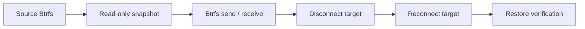

# Testing

## Automated Suite

The default local suite runs without real Btrfs devices:

```bash
./tests/run-tests.sh
```

Mode without root-only operations:

```bash
./tests/run-tests.sh --static-only
```

Tests cover:

1. syntax of remaining shell launchers and install hooks;
2. multi-source rendering without unresolved placeholders;
3. systemd unit and udev rule validation;
4. canonical profile JSON validation, rendering, save, show, and export;
5. per-profile status and history JSON.

The focused systemd security contract can also be run directly:

```bash
tests/systemd/check-security.sh data/systemd/btrfs-backup@.service.example
```

It asserts the required directives and runs offline `systemd-analyze security`
with a maximum accepted exposure level of 8. The GitHub Actions security job
runs this check for every push and pull request.

## Mock Boundaries

C++ unit tests cover the native backup entrypoint, target mount/eject commands,
planning, transfer orchestration, recovery, retention, status writing and
validation logic. Focused regression coverage includes:

1. concurrent runners for one profile, one shared LUKS UUID, and independent
   targets;
2. a 1 GiB producer/consumer stream under kernel-pipe backpressure;
3. bounded SIGTERM-to-SIGKILL escalation and child reaping after partial spawn
   or exception unwind;
4. durable-write failures for ENOSPC, EIO, file and directory `fsync`, close,
   rename, and EINTR;
5. file-request and SIGINT/SIGTERM cancellation through terminal `cancelled`
   status while recovery state remains available;
6. fractional aggregate progress during both the first and later sources;
7. trusted hook file type, ownership/mode policy, symlink rejection, inherited
   descriptor execution, and resistance to pathname replacement after opening.

Production use also needs a test on a real or disposable environment:



The test should also cover process interruption, low disk space, and device loss.

## QEMU Hotplug System Tests

The Docker integration test is useful for real Btrfs, LUKS and package
installation coverage, but it still cannot model the full desktop/system
boundary: kernel hotplug events, udev rule delivery, systemd instance startup,
device disappearance and reconnect behavior. Those cases belong in a separate
QEMU-based system test target, outside the default suite.

The target scenario should boot a minimal Arch Linux guest, install the package
from the current source tree, create a Btrfs source filesystem, then dynamically
attach a virtual USB target disk. The test should let udev trigger the
configured systemd instance and verify:

1. first full transfer;
2. second incremental transfer;
3. target detach after a successful run;
4. reconnect of the same target;
5. recovery from pending state created by an interrupted run;
6. status and history JSON with stable `errorCode`, `errorMessage`, `details`,
   `recoverable` and `suggestedAction` fields.

Failure scenarios should be injected at the process or block-device boundary,
not by shell mocks:

1. `SIGKILL` for `btrfs send`;
2. `SIGKILL` for `btrfs receive`;
3. ENOSPC on the target;
4. target remounted read-only;
5. mapper loss while the run is active;
6. corrupted active profile JSON;
7. stale pending marker from an old run;
8. interruption during commit;
9. interruption after commit but before history write;
10. guest suspend while transfer is active.

Keep this harness opt-in. It needs QEMU, nested privileges, disposable disk
images, and root-equivalent control inside the guest, so it should not run from
`make` or the default local test script.

The current boundary smoke test is:

```bash
tests/qemu/run-hotplug.sh
```

It boots a disposable Arch/systemd root, installs the current base package,
attaches a LUKS-formatted virtual USB disk through QMP and verifies on the guest
serial console that udev starts `btrfs-backup@default.service` while no
graphical target is active. The broader transfer and failure-injection matrix
above remains separate follow-up work. For a regular user the script performs
the mount and loop operations inside a disposable privileged Docker container,
so host-side `sudo` is not required. Direct execution as root remains available
for CI environments that already provide an isolated worker. Permission to use
the Docker daemon and privileged containers is root-equivalent and must not be
treated as a reduced security boundary. Package compilation runs first in a
non-privileged build container; the privileged worker receives only the
finished package through a read-only mount.

Local runner tests cover the file-based cancellation request and verify that an
active transfer sees the request, reports `runner.cancelled`, and clears the
handled marker. Future privileged-control tests should still verify that manual
start, force, validate, cancel and eject operations cannot conflict with an
active backup unit, cannot operate on a mismatched profile id, and cannot affect
unrelated processes or targets.

## Real Btrfs Docker Test

The repository also includes a heavier Docker integration test that builds and
installs the Arch base and KDE packages, then uses real loop-backed filesystems
inside a privileged container. It creates:

1. installable `btrfs-backup` and `btrfs-backup-kde` packages from the current
   source tree;
2. a source Btrfs filesystem with a `home` subvolume;
3. a LUKS2 target image with a Btrfs filesystem inside `/dev/mapper`;
4. rendered configuration from the installed `btrfs-backupctl`;
5. active test configuration under `/etc/btrfs-backup` inside the container.

Run it with:

```bash
tests/integration/docker/run-real-btrfs.sh
```

The Docker run uses `--privileged` because the test needs loop devices, device
mapper, mounts, and Btrfs ioctls. It does not read or write the host backup
configuration. The repository is mounted read-only into the container, the
package is built under `/tmp`, and all test filesystems live under `/tmp` inside
the container.

The test covers:

1. base and KDE package build and installation through `pacman -U`;
2. configuration rendering and validation through the installed CLI;
3. runtime validation of the mounted target;
4. rejection of a mismatched target Btrfs UUID;
5. rejection of a source located on the backup target filesystem;
6. a real full `btrfs send/receive`;
7. a real incremental `btrfs send -p` after source data changes;
8. rejection of an incremental run when remote snapshots exist but no local
   UUID-matching parent is available;
9. verification that the latest remote snapshot matches the latest local
   snapshot;
10. verification that the remote snapshot `Received UUID` matches the local
   snapshot UUID;
11. local and remote retention after a third backup;
12. cleanup of per-source `.incoming` content after successful receives;
13. per-profile `current.json` and history JSON after a real backup.
14. recovery of an orphaned local snapshot left before receive;
15. preservation and marker cleanup for a snapshot committed before an
    interruption;
16. a full restore send/receive from the latest repository snapshot followed by
    content comparison.
17. rejection of a per-source `.incoming` symlink escape with verification that
    data outside the target repository remains unchanged;
18. execution of a trusted root-owned hook and rejection after unsafe owner,
    file mode, parent mode, or symlink changes;
19. offline `systemd-analyze security` against the installed unit;
20. a complete real Btrfs backup started through the sandboxed systemd profile
    service, including the pre-sandbox target mount dependency;
21. automatic host unmount and LUKS closure through the post-run eject unit.

The current Plasma test target validates its status-only process model and
read-only API surface. Cancellation authorization and target safe-removal
behavior belong to the future system D-Bus/polkit and target-status test targets
described in the [system manager design](design/system-manager.md). The active
sprint selects the next bounded portion of that work in [`TODO.md`](../TODO.md).

## Release Checks

`tools/build-release.sh --target all` runs tests, creates the source tarball, builds all supported release targets, and writes SHA-256 reports. Package targets that produce installable archives are also smoke-tested where practical. After building the Arch target, also check:

```bash
tar --zstd -tf dist/btrfs-backup-3.0.0-1-x86_64.pkg.tar.zst
sha256sum -c dist/SHA256SUMS
```
